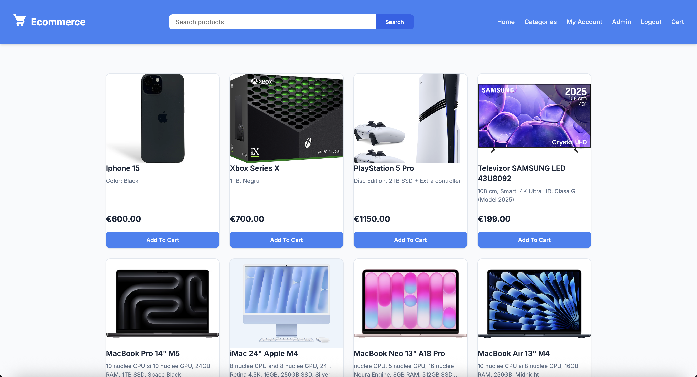

<!-- Improved compatibility of back to top link: See: https://github.com/othneildrew/Best-README-Template/pull/73 -->
<a id="readme-top"></a>

<!-- PROJECT LOGO -->
<br />
<div align="center">
  <a href="https://github.com/shorodokvlad/ecommerce-app">
    
  </a>

<h3 align="center">Ecommerce App</h3>

  <p align="center">
    A comprehensive full-stack Ecommerce Application built with Spring Boot and React.
    <br />
  </p>
</div>

<!-- ABOUT THE PROJECT -->
## About The Project

This is a complete E-commerce application featuring a Java Spring Boot backend and a React frontend. The application allows users to browse products, manage their shopping carts, process orders, and manage authentication securely.

Key features include:
* Full user authentication and authorization utilizing JSON Web Tokens (JWT)
* Product catalog and state persistence managed securely via MySQL
* Seamless integration with Amazon Web Services (AWS) S3 for scalable media and image storage
* Interactive frontend built with React, styled effectively for eCommerce usage

<p align="right">(<a href="#readme-top">back to top</a>)</p>

### Built With

* [![Spring Boot][SpringBoot-shield]][SpringBoot-url]
* [![React][React-shield]][React-url]
* [![MySQL][MySQL-shield]][MySQL-url]
* [![AWS S3][AWS-shield]][AWS-url]

<p align="right">(<a href="#readme-top">back to top</a>)</p>

<!-- GETTING STARTED -->
## Getting Started

Follow these instructions to get a copy of the project up and running locally for development and testing.

### Prerequisites

You need to install the following on your machine:
* **Java 17** (or compatible JDK version)
* **Node.js** and **npm**
* **MySQL Server**
* **Maven**

### Installation

1. **Clone the repository**
   ```sh
   git clone https://github.com/shorodokvlad/ecommerce-app.git
   ```
2. **Setup the Database**
   * Make sure your MySQL server is running on port `3306`.
   * Create a new database named `ecommerce`:
     ```sql
     CREATE DATABASE ecommerce;
     ```
3. **Configure the Backend**
   * Navigate to `src/main/resources/application.properties`
   * Modify the datasource credentials (`spring.datasource.username` and `spring.datasource.password`) if yours differ from `root` and `123456789`.
   * (Optional) Update `secreteJwtString` and `aws.s3.*` values for production environments.
4. **Run the Backend**
   * From the root directory, use the Maven wrapper:
     ```sh
     ./mvnw spring-boot:run
     ```
   * The backend API server will start on port `2424`.
5. **Install Frontend Dependencies**
   * Open a new terminal and navigate to the `client` directory:
     ```sh
     cd client
     npm install
     ```
6. **Start the Frontend**
   * Launch the development server:
     ```sh
     npm start
     ```
   * Your browser should automatically open `http://localhost:3000`.

<p align="right">(<a href="#readme-top">back to top</a>)</p>

<!-- USAGE EXAMPLES -->
## Usage

Once both servers are running:
* **Customers** can register, log in, view items across different categories, and add items to the cart.
* State management retains the cart across navigation, while HTTP API calls persist real order information securely in MySQL.
* Uploaded products are instantly managed on AWS S3 to optimize performance.

<p align="right">(<a href="#readme-top">back to top</a>)</p>


<!-- LICENSE -->
## License

Distributed under the MIT License. See `LICENSE.md` for more information.

<p align="right">(<a href="#readme-top">back to top</a>)</p>

<!-- CONTACT -->
## Contact

Vladislav Shorodok - [@shorodokvlad](https://twitter.com/shorodokvlad) - vlad.shorodoc@gmail.com

Project Link: [https://github.com/shorodokvlad/ecommerce-app](https://github.com/shorodokvlad/ecommerce-app)

<p align="right">(<a href="#readme-top">back to top</a>)</p>


<!-- MARKDOWN LINKS & IMAGES -->
[SpringBoot-shield]: https://img.shields.io/badge/Spring_Boot-6DB33F?style=for-the-badge&logo=spring-boot&logoColor=white
[SpringBoot-url]: https://spring.io/projects/spring-boot
[React-shield]: https://img.shields.io/badge/React-20232A?style=for-the-badge&logo=react&logoColor=61DAFB
[React-url]: https://reactjs.org/
[MySQL-shield]: https://img.shields.io/badge/MySQL-00000F?style=for-the-badge&logo=mysql&logoColor=white
[MySQL-url]: https://www.mysql.com/
[AWS-shield]: https://img.shields.io/badge/Amazon_AWS-232F3E?style=for-the-badge&logo=amazon-aws&logoColor=white
[AWS-url]: https://aws.amazon.com/
